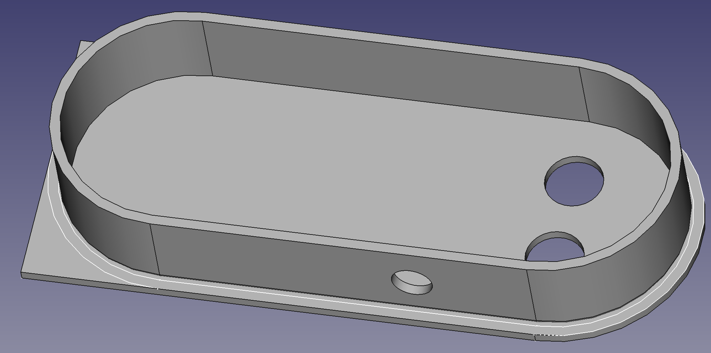
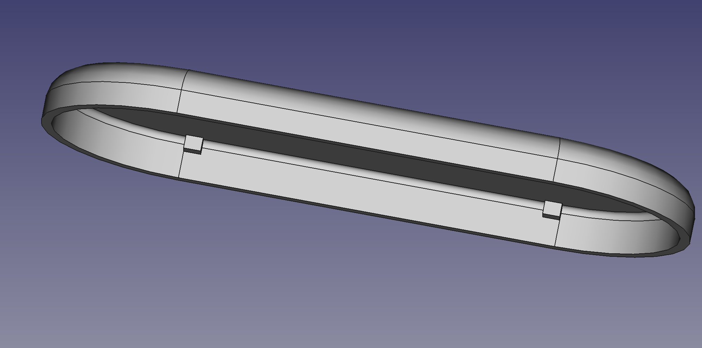

# Home Depot Sump tub lid monitor 

* Engineering drawing on page: https://www.homedepot.com/p/Everbilt-18-in-Sump-Pump-Basin-Lid-SF60913/204733082
* Specs for config: https://github.com/alaudet/raspi-sump/blob/master/conf/raspisump.conf
* Sump specifics:
** Pit depth 54cm
** Pump starts at ~22cm
** So critical water height ~40cm
** diameter 18" ==> 45c

## CAD
CAD consists of:
1. Base plate with holes for HC-SR04 ultrasonic sensor
2. Oval shaped wall to house Raspi
3. Lid for oval shape including air slots. 
4. Extension piece to fill rest of slot in tub lid.

Notes:
* Parts can be assembled with super glue or hotglue
* Cad files created using FreeCAD and exported into STL
* STL sliced using Cura
* Printed on an Creality Ender3
