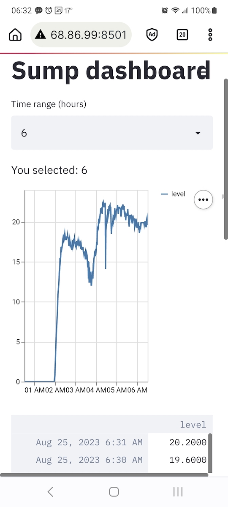

#  Streamlit on Raspi 

Streamlit is awesome way to get userspace httpd dashboard  
Want to use pandas so some dependencies :-/ 

## Troublesome apache arrow dependency
```
sudo apt-get install python-dev libatlas-base-dev
sudo pip3 install numpy pandas ~~streamlit~~ plotly
```
* ~~https://discuss.streamlit.io/t/raspberry-pi-streamlit/2900/26?page=2~~
### ~~Deadend with apache arrow dependency~~
## Don't need latest and greatest so alternative happy path:
```
sudo pip3 install streamlit==0.62.0
```

## To execute:
````
streamlit run file.py
```
Notes:
* water and temp in the raspi csv directory
* point browser at [http://localhost:8501](http://localhost:8501)
* make init scripts so starts as service on boot


## References
* https://streamlit.io/
